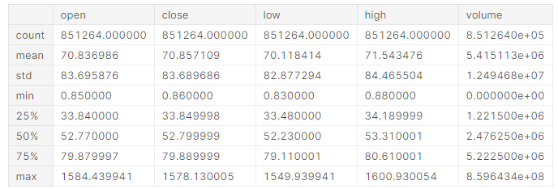
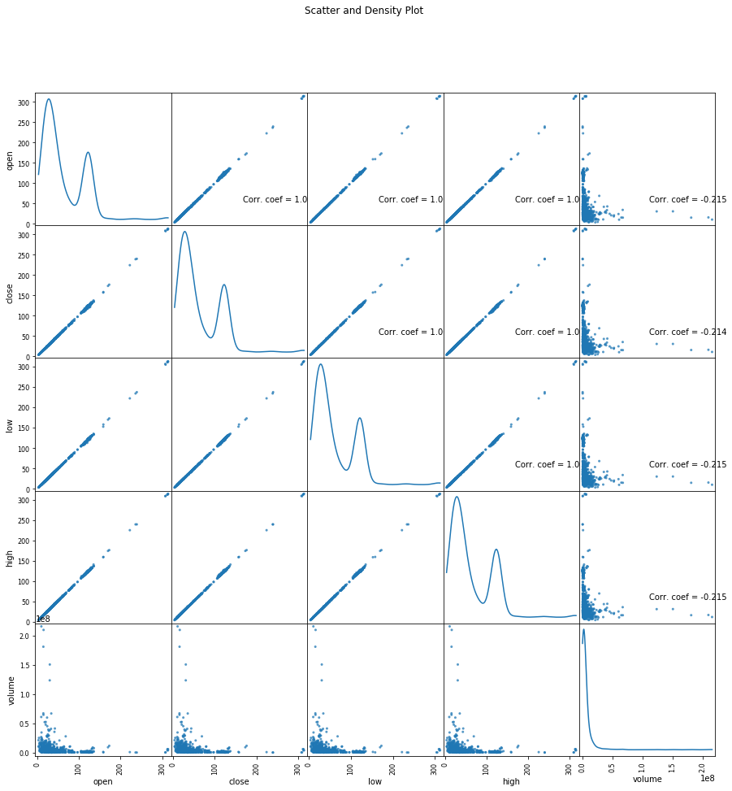
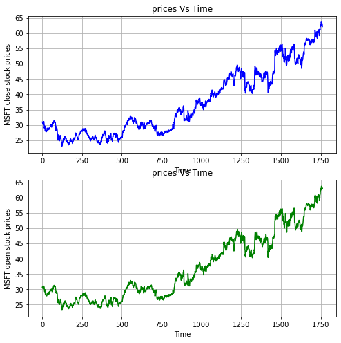
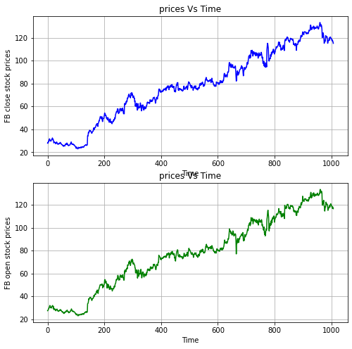

## New York Stock Exchange S&P 500 companies historical prices with fundamental data Dataset analysis 

### Stage 1

New York Stock Exchange  Kaggle Dataset is S&P 500 companies historical prices with fundamental data.

# Dataset consists of following files:

1. prices.csv: raw, as-is daily prices. Most of data spans from 2010 to the end 2016, for companies new on stock market date range is shorter. There have been approx. 140 stock splits in that time, this set doesn't account for that.
2. prices-split-adjusted.csv: same as prices, but there have been added adjustments for splits.
3. securities.csv: general description of each company with division on sectors
4. fundamentals.csv: metrics extracted from annual SEC 10K fillings (2012-2016), should be enough to derive most of popular fundamental indicators.

In addition, Prices were fetched from Yahoo Finance, fundamentals are from Nasdaq Financials, extended by some fields from EDGAR SEC databases.

# Following algorithms and actions could be applied by using this Data set:
- One day ahead prediction: Rolling Linear Regression, ARIMA, Neural Networks, LSTM
- Momentum/Mean-Reversion Strategies
- Security clustering, portfolio construction/hedging

Datasets consist of following variables:

- Open Price is a price of stock when stock market is opened.
- Close Price is a price of stock after closure stock market.
- Low Price is a minimal price of stock during the day. 
- High Price is a highest price of the stock.
- Volume is measured in the number of shares traded.
- Ticker Symbol is a Symbol of Stock in New York Stock Exchange market.
- Accounts Payable is money owed by a business to its suppliers shown as a liability on a company's balance sheet.
- Accounts receivable are legally enforceable claims for payment held by a business for goods supplied or services rendered that customers have ordered but not paid for.
- Return on equity (ROE) is a measure of financial performance calculated by dividing net income by shareholders' equity.
- Capital expenditure or capital expense is the money an organization or corporate entity spends to buy,
- Capital surplus, also called share premium, is an account which may appear on a corporation's balance sheet, as a component of shareholders' equity, which represents the amount the corporation raises on the issue of shares in excess of their par value of the shares.
- The cash ratio is a measurement of a company's liquidity, specifically the ratio of a company's total cash and cash equivalents to its current liabilities.

### Stage 2

In order to make stock price prediction Open Price, Close Price, Low Price and Volume variables are used. 
In general following could be told based on figure below:

As it is visible from table above the Mean openining is 70.83 whereas mean closing value is 70.85. In addition, the mean low and high values are 70.11 and 71.54 respectively. 
The maximum mean values are fluctiating between 1549 and 1600.

Scatter and Density plot is also constructed covering Open Price, Close Price, Low Price and Volume variables 

In addition, analysis is done on Facebook and Microsoft stocks too. 
   

### Stage 3

### Stage 4

### Stage 5
